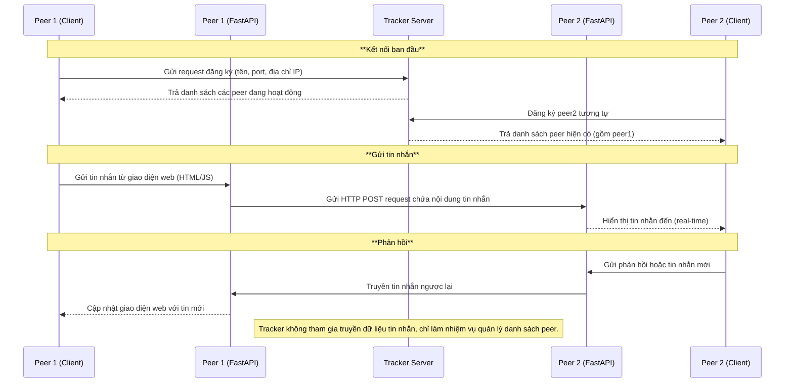

# BTL1-MMT Peer-to-Peer Chat System

Một hệ thống **P2P Chat** đơn giản gồm **Tracker Server** và nhiều **Peer Node**, được xây dựng bằng **FastAPI** và có thể chạy qua **Docker Compose**.

---

## 📖 Giới thiệu

Dự án mô phỏng cơ chế hoạt động của một mạng **peer-to-peer**:
- **Tracker** đóng vai trò trung tâm để các peer đăng ký và lấy danh sách các peer đang hoạt động.  
- **Peer** là các nút chat có thể gửi và nhận tin nhắn trực tiếp với nhau thông qua HTTP API.  

Mỗi peer có giao diện web riêng để gửi tin nhắn, xem danh sách peer, và hiển thị lịch sử chat.

---

## ⚙️ Cấu trúc thư mục

```
weaprous-chat/
│
├── tracker/
│   └── tracker.py              # Máy chủ trung tâm lưu danh sách các peer
│
├── peer/
│   ├── app.py                  # Ứng dụng chính của mỗi peer (FastAPI)
│   ├── templates/
│   │   └── index.html          # Giao diện web chính của peer
│   └── static/
│       ├── style.css           # Giao diện (CSS)
│       └── script.js           # Logic trình duyệt (JavaScript)
│
├── Dockerfile
├── docker-compose.yml
└── README.md
```

---

## 🚀 Cách chạy

###  Khởi động hệ thống
Chạy tất cả container (tracker + 2 peer):
```
docker compose up --build
```

###  Truy cập giao diện chat
Mở trình duyệt:
- http://localhost:9002 → Peer 1  
- http://localhost:9003 → Peer 2  
- ./images/test_peer_to_peer.mp4

---

## 🧩 Cách hoạt động

### 🔹 Tracker
- Cung cấp 2 API chính:
  - `POST /register`: Peer đăng ký địa chỉ và cổng.
  - `GET /peers`: Trả danh sách các peer đang online.

### 🔹 Peer
- Gửi yêu cầu đăng ký lên tracker.
- Gửi và nhận tin nhắn giữa các peer thông qua:
  - `POST /broadcast` – gửi tin đến tất cả peer khác.
  - `POST /message` – nhận tin nhắn từ peer khác.
- Mỗi tin nhắn đều được ghi lại cùng **thời gian máy tính thực tế** (local time).


---

## 💬 Giao diện chat

- Khi truy cập trang web của peer, anh có thể:
  - Nhấn **Register** để đăng ký với tracker.
  - Nhấn **Load Peers** để xem các peer khác.
  - Nhập tin nhắn và nhấn **Send** để gửi broadcast.
- Tin nhắn hiển thị dạng:
  ```
  [21:05:12] You: Hello  
  [21:05:14] peer2: Hi peer1
  ```

---
